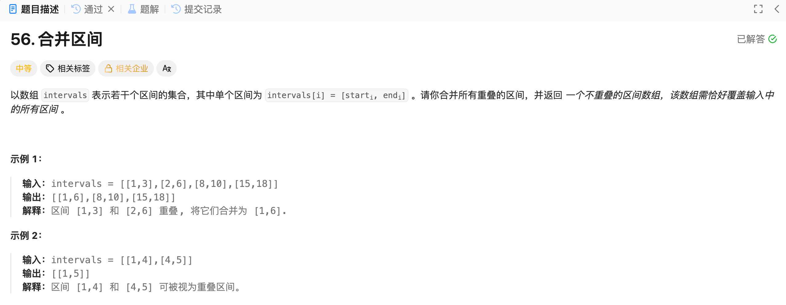

## 合并区间(贪心)




### 思路

1. 对数组按照左端点排序
2. 假设当前数组的左右端点是 left1、right1，下一个数组的左右端点是left2、right2；
   - 如果left2 <= right1，说明可以合并；
     - 新区间的左端点是left1，因为left1 始终小于等于 left2，排序过了
     - 新区间的右端点是 max(right1, right2)
   - 如果left2 > right1，说明不可以合并，
     - 直接以left1和right1构造vector插入到ret中
     - 然后让 left2 和 right2 作为基准值继续向后判断
3. 如果最后一个数组可以和前面的数组合并，只改变了right，并没有插入数组；如果最后一个数组不可以和前面的数组合并，那最后一个数组就没有插入，所以最后要插入{left1, right1}的数组。


### 代码

```c++
class Solution 
{
public:
    vector<vector<int>> merge(vector<vector<int>>& intervals) 
    {
      	// 排序
        sort(intervals.begin(), intervals.end());

        vector<vector<int>> ret;
      	// 合并
        int left1 = intervals[0][0], right1 = intervals[0][1];
        for (int i = 1; i < intervals.size(); ++i)
        {
            int left2 = intervals[i][0], right2 = intervals[i][1];
						
          	// 这种情况可以合并
            if (left2 <= right1)
            {
                right1 = max(right1, right2);
            }
            else
            {
                ret.push_back({left1, right1});
                left1 = left2;
                right1 = right2;
            }
        }
        ret.push_back({left1, right1});
        return ret;
    }
};
```

