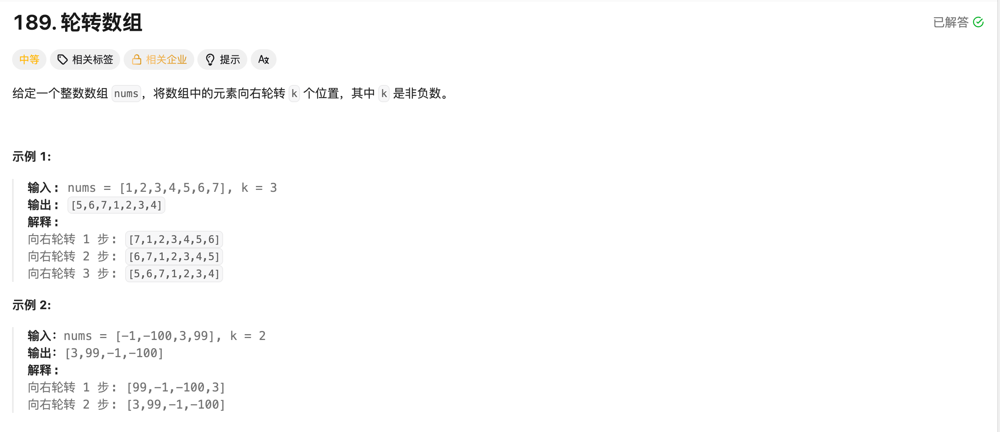

## 轮转数组




### 方法一

1. 原数组中 nums[i] 的元素应该放到了 nums[(i + k) % n] 的位置;
2. 可以建立一个新数组，将 tmp[(i + k) % n] = nums[i];
3. 最后交换即可。


```c++
class Solution 
{
public:
    void rotate(vector<int>& nums, int k) 
    {
        vector<int> tmp(nums.size());

        for (int i = 0; i < tmp.size(); ++i)
        {
            tmp[(i + k) % tmp.size()] = nums[i];
        }
        nums = move(tmp);
    }
};
```


### 方法二

1. 如果要进行 K 次轮转，那么原本数组的最后 K 个元素肯定是挪动到前面去了；
2. 可以先将整个数组逆置一下
3. 然后在对 [0, (k % n) - 1] 逆置
4. 最后再对[k % n, n - 1]逆置


```c++
class Solution 
{
public:
    void reverse(vector<int>& nums, int begin, int end)
    {
        while (begin < end)
        {
            swap(nums[begin], nums[end]);
            ++begin;
            --end;
        }
    }
    void rotate(vector<int>& nums, int k) 
    {
        int n = nums.size();
        k = k % n;
        reverse(nums, 0, n - 1);
        reverse(nums, 0, k - 1);
        reverse(nums, k, n - 1);
    }
};
```

