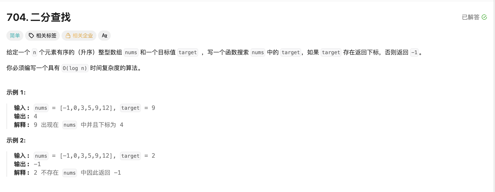

## 二分查找

[题目链接](https://leetcode.cn/problems/binary-search/solutions/980494/er-fen-cha-zhao-by-leetcode-solution-f0xw/)

### 题目描述



### 解题思路

> 二分查找的题目首先要搞清楚什么时候出循环：
>
> - 当 left 和 right 指向同一个位置的时候仍然需要判断，所以出循环的条件是 left > right;
>
> 1. 每次取中间，val大，left = mid + 1；
> 2. val小，right = mid - 1；
> 3. val == target，返回
>
> 取中间元素可以用 mid = (right - left) / 2 + left;意思是让left走区间一半的步长就到中间了，防止溢出。


### 实现代码

```cpp
class Solution 
{
public:
    int search(vector<int>& nums, int target) 
    {
        int left = 0, right = nums.size() - 1;
        int ans = -1;
        // left > right 出循环
        while (left <= right)
        {
            int mid = left + (right - left) / 2;
            if (nums[mid] == target)
            {
                ans = mid;
                break;
            } 
            else if (nums[mid] > target) right = mid - 1;
            else left = mid + 1;
        }
        return ans;
    }
};
```


### 计算 mid

> 1. int mid = left + (right - left + 1) / 2；1️⃣
> 2. int mid = left + (right - left) / 2。2️⃣
>    - 当有奇数个元素5，那么left = 0， right = 4，mid 用这两种方法计算都是 2；
>    - 当有偶数个元素4，那么left = 0， right = 3，mid用1️⃣计算就是2，用2️⃣计算就是1。
>    - 因为偶数有两个中间元素。

