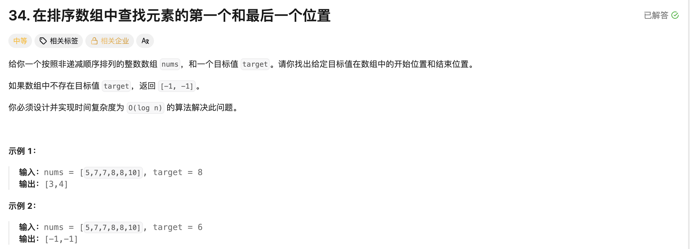

## 在排序数组中查找元素的第一个和最后一个位置

[题目链接](https://leetcode.cn/problems/find-first-and-last-position-of-element-in-sorted-array/description/)

### 题目描述




### 解题思路

> 就是找左右端点：
>
> 1. 找左端点
>    - 将数组分成两个区间，left区间中都是小于target的值，right区间中都是大于等于target的值；
>    - 计算 mid = left + (right - left) / 2; (看只有两个元素的时候)
>      - 当 midval >= target，让right = mid; (防止mid就是最左端点)
>      - 当 midval < target，让left = mid + 1; (说明mid及其左侧不可能有端点)
>    - 当left >= right时，退出判断。
> 2. 找右端点
>    - 将数组分成两个区间，left区间都是小于等于target的值，right区间中都是大于target的值；
>    - 计算 mid = left + (right - left + 1); (看只有两个元素的时候)
>      - 当 midval <= target，让 left = mid; (防止mid就是最右端点)
>      - 当 midval > target，让 right = mid - 1; (说明right及其右边不可能有端点)
>    - 当 left >= right 时，退出判断。


### 实现代码

````cpp
class Solution 
{
public:
    vector<int> searchRange(vector<int>& nums, int target) 
    {
        if (nums.empty()) return {-1, -1};
        int left = 0, right = nums.size() - 1;
        vector<int> ans;
        // 1. 找左端点
        while (left < right)
        {
            int mid = left + (right - left) / 2;
            if (nums[mid] >= target) right = mid;
            else left = mid + 1;
        }
        if (nums[left] == target) ans.push_back(left);
        else ans.push_back(-1);

        // 2. 找右端点
        left = 0, right = nums.size() - 1;
        while (left < right)
        {
            int mid = left + (right - left + 1) / 2;
            if (nums[mid] <= target) left = mid;
            else right = mid - 1;
        }
        if (nums[left] == target) ans.push_back(left);
        else ans.push_back(-1);
        //if (ans.empty()) return {-1, -1};
        return ans;
    }
};
````

