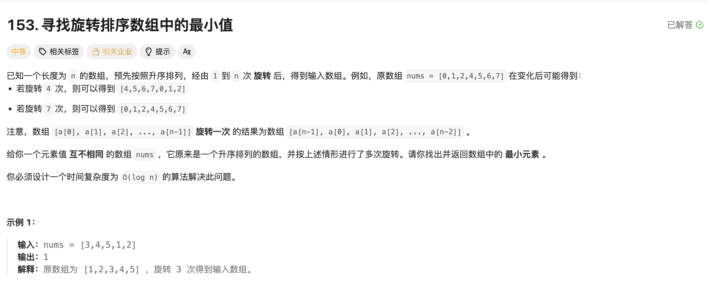

## 3. 寻找旋转排序数组中的最小值

[题目链接](https://leetcode.cn/problems/find-minimum-in-rotated-sorted-array/)


### 题目描述




### 解题思路

> 1. 当找到的mid > 数组的最后一个值时，说明这个数据在最小值的前面，只要让left = mid + 1 就可以了；
> 2. 当找到的mid < 数组中的最后一个值时，说明这个数据在最小值的后面，只要让 right = mid，但是不可以等于mid - 1，因为可能会跳过最小的元素。


### 实现代码

````cpp
class Solution 
{
public:
    int findMin(vector<int>& nums) 
    {
        int left = 0, right = nums.size() - 1;
        while (left < right)
        {
            int mid = left + (right - left) / 2;
            if (nums[mid] > nums[nums.size() - 1]) left = mid + 1;
            else right = mid;
        }
        return nums[left];
    }
};
````

