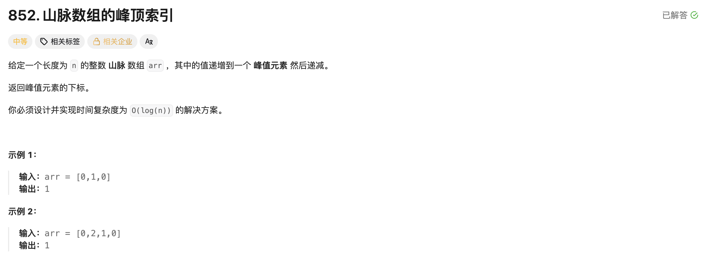

## 山脉数组的峰顶索引

[题目链接](https://leetcode.cn/problems/peak-index-in-a-mountain-array/description/)

### 题目描述




### 解题思路

> 此题具有二段性，先递增，后递减，可以用二分。
>
> 1. 让左边的区间都是递增的，右边的区间都是递减的；
> 2. 如果 midval 大于它之前的一个元素，就让 left = mid（防止mid就是最大的元素），否则让 right = mid - 1； 
> 3. 直到 left == right。


### 实现代码

````cpp
class Solution 
{
public:
    int peakIndexInMountainArray(vector<int>& arr) 
    {
        int left = 0, right = arr.size() - 1;
        while (left < right)
        {
            int mid = left + (right - left + 1) / 2;
            if (arr[mid] > arr[mid - 1]) left = mid;
            else right = mid - 1;
        }
        return left;
    }
};
````

