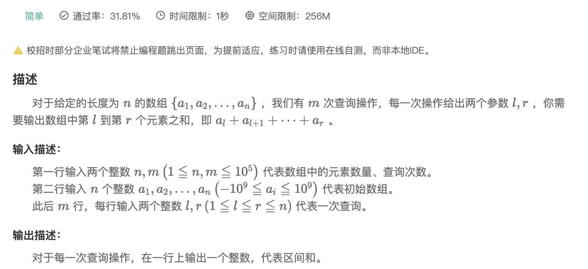

## 【模版】前缀和

[题目链接](https://www.nowcoder.com/practice/acead2f4c28c401889915da98ecdc6bf?tpId=230&tqId=2021480&ru=/exam/oj&qru=/ta/dynamic-programming/question-ranking&sourceUrl=%2Fexam%2Foj%3Fpage%3D1%26tab%3D%25E7%25AE%2597%25E6%25B3%2595%25E7%25AF%2587%26topicId%3D196)

### 题目描述




### 题目思路

> 额外创建一个数组dp，该数组的值表示原数组 1～该数组下标的和，即dp[i] = dp[i - 1] + arr[i];
>
> 给定范围 L ～ R，输出的值可以看作dp[R] - dp[L - 1];


### 解题思路

````cpp
#include <iostream>
#include <vector>
using namespace std;

int main() 
{
    int n = 0, q = 0;
    cin >> n >> q;
    vector<long long> dp(n + 1, 0);
    vector<long long> old(n + 1, 0);
    for (int i = 1; i <= n; ++i) 
    {
        cin >> old[i];
        dp[i] = dp[i - 1] + old[i];
    }

    int l, r;
    while (cin >> l >> r)
    {
        cout << dp[r] - dp[l - 1] << endl;
    }
    return 0;
}

````

