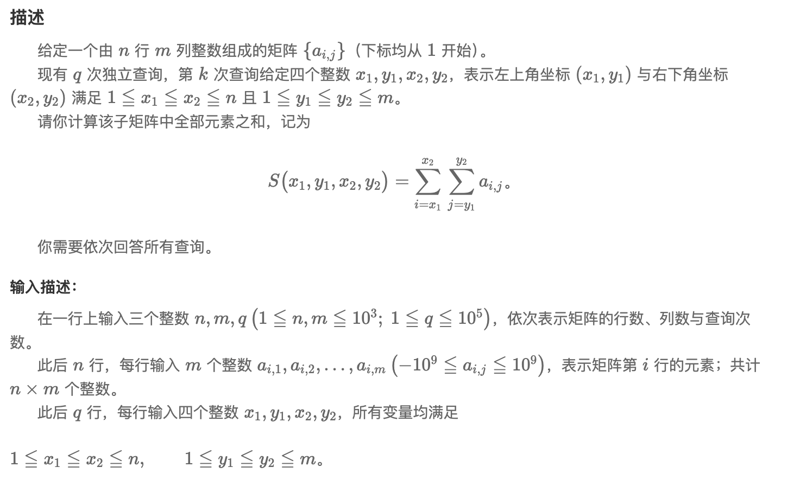

## 【模版】二位前缀和

[题目链接](https://www.nowcoder.com/practice/99eb8040d116414ea3296467ce81cbbc?tpId=230&tqId=2023819&ru=/exam/oj&qru=/ta/dynamic-programming/question-ranking&sourceUrl=%2Fexam%2Foj%3Fpage%3D1%26tab%3D%25E7%25AE%2597%25E6%25B3%2595%25E7%25AF%2587%26topicId%3D196)


### 题目描述




### 解题思路

> - 在输入过程中直接计算，记录从坐标（0，0）到当前坐标（x,y)所构成矩形的和，查询Q(x1,y1)to(x2,y2)=SUM(x2,y2)−SUM(x1−1,y2)−SUM(x2,y1−1)+SUM(x1−1,y1−1)*Q*(*x*1,*y*1)*t**o*(*x*2,*y*2)=*S**U**M*(*x*2,*y*2)−*S**U**M*(*x*1−1,*y*2)−*S**U**M*(*x*2,*y*1−1)+*S**U**M*(*x*1−1,*y*1−1).


### 实现代码

````cpp
#include <iostream>
#include <vector>
using namespace std;

int main() 
{
    int r, c, q;
    cin >> r >> c >> q;

    vector<vector<long long>> old;
    vector<vector<long long>> dp;
    old.resize(r + 1);
    dp.resize(r + 1);
    for (int i = 0; i <= r; ++i) old[i].resize(c + 1, 0);
    for (int i = 0; i <= r; ++i) dp[i].resize(c + 1, 0);
    
    for (int i = 1; i <= r; ++i)
    {
        for (int j = 1; j <= c; ++j)
        {
            cin >> old[i][j];
            dp[i][j] = dp[i - 1][j] +dp[i][j - 1] - dp[i - 1][j - 1] + old[i][j];
        }
    }

    while (q--)
    {
        int x1, y1, x2, y2;
        cin >> x1 >> y1 >> x2 >> y2;

        cout << dp[x2][y2] - dp[x1 - 1][y2] - dp[x2][y1 - 1] + dp[x1 - 1][y1 - 1] << endl;
    }

}
````

