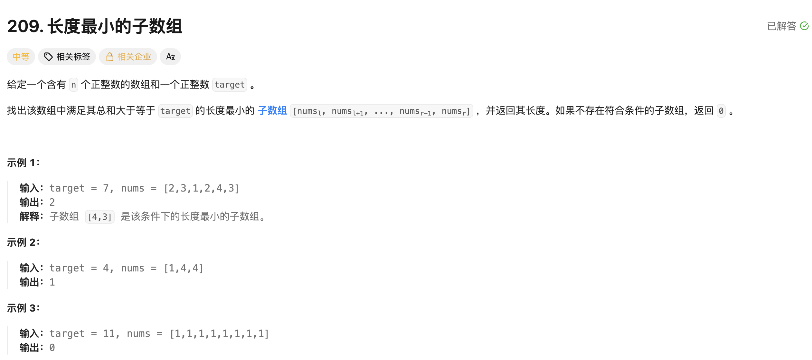

## 长度最小的子数组

[题目链接](https://leetcode.cn/problems/minimum-size-subarray-sum/description/)

### 1. 题目描述



### 2. 解题思路

> 滑动窗口的题目考虑三个步骤：
>
> - 何时进窗口
> - 何时出窗口
> - 何时更新结果
>
> 1. 此题每次让right对应的val进窗口，即 sum+=nums[right]；
>
> 2. 当 sum >= target 时出窗口：出窗口前需要更新结果，判断此次 ans 的值是否小于上一次 ans 的值，然后再让 left 出窗口（sum -= nums[left]; ++left)。


### 3. 实现代码

```c++
class Solution 
{
public:
    int minSubArrayLen(int target, vector<int>& nums) 
    {
        int left = 0, right = 0;
        int sum = 0;
        int ans = nums.size() + 1;

        for (right = 0; right < nums.size(); ++right)
        {
          	// 进窗口
            sum += nums[right];

          	// 出窗口
            while (sum >= target)
            {
              	// 更新结果
                if (ans > right - left + 1) ans = right - left + 1;
                sum -= nums[left];
                ++left;
            }
        }
        return (ans == nums.size() + 1) ? 0 : ans;
    }
};
```

