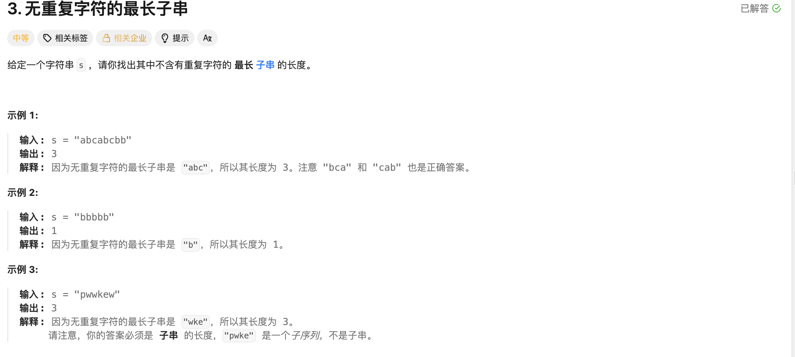

## 无重复字符的最长字串

[题目链接](https://leetcode.cn/problems/longest-substring-without-repeating-characters/description/)

### 1. 题目描述




### 2. 解题思路

> 滑动窗口的题目考虑三个步骤：
>
> - 何时进窗口
> - 何时出窗口
> - 何时更新结果
>
> 1. 先用数组模拟哈希表，每次让string中的字符串进入窗口，也就是进入哈希表；
> 2. 当此元素对应的哈希表的下标的值大于1了，就说明有重复的元素，在窗口中找到相同的val：
>    - 当left和right对应的val不相等时，left对应的值出窗口，++left；
>    - 当left和right对应的val相等时，left对应的值出窗口，++left；
>    - 因此逻辑可以合并。
> 3. 每次进窗口如果没有重复的元素就要更新结果；如果有重复的元素，去除重复的元素再更新结果。
> 4. 为什么可以用滑动窗口：
>    - 如果有重复的元素，对于left到right中的不等于right_val前的所有元素肯定已经是最大的子串了;
>    - 因此不需要再让left++; right = left + 1; 重新找子串，只需要找到等于right_val的下一个元素继续进行判断。


### 3. 实现代码

```c++
class Solution 
{
public:
    int lengthOfLongestSubstring(string s) 
    {
        int left = 0, right = 0;
        int hash[1024] = {0};
        int ans = 0;
        for (right = 0; right < s.size(); ++right)
        {
            ++hash[s[right]];
            while (hash[s[right]] > 1)
            {
                // if (s[left] == s[right])
                // {
                //     --hash[s[left]];
                //     ++left;
                // }
                // else
                // {
                //     --hash[s[left]];
                //     ++left;
                // }
                --hash[s[left]];
                ++left;
            }
            if (ans < right - left + 1) ans = right - left + 1;
        }
        return ans;
    }
};
```

