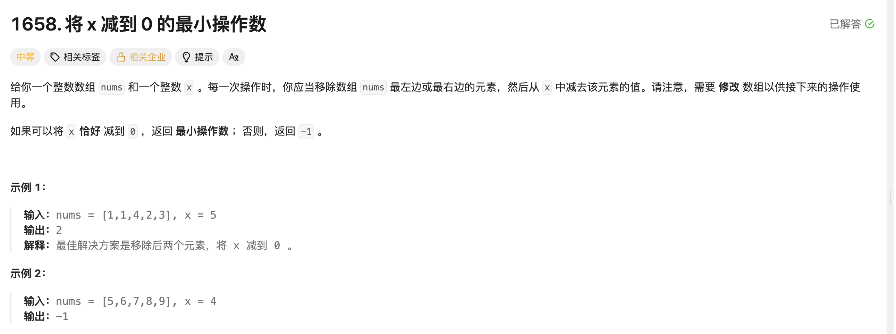

## 将 x 减到 0 的最小操作数

[题目链接](https://leetcode.cn/problems/minimum-operations-to-reduce-x-to-zero/description/)

### 1. 题目描述




### 2. 解题思路

> 这题可以转化为求数组内和是 target: sum-x 的最长子数组，就可以用滑动窗口来解决了，和长度最小的子数组思路类似：
>
> 1. 每次让right_val进入窗口；
> 2. 当和大于target时，left++，出窗口；
> 3. 如果结果等于target，最后更新结果，否则不更新结果，因此可以设置变量flag，如果进入这个条件判断就是true，否则就是false；
> 4. 最后返回结果的时候判断flag是否是false，是的话就返回-1，true就返回 size() - (right - left + 1)。


### 3. 实现代码

```c++
class Solution 
{
public:
    int minOperations(vector<int>& nums, int x) 
    {
        int sum = 0;
        for (auto e : nums)
        {
            sum += e;
        }
        int target = sum - x;
        int left = 0, right = 0, ans = 0, tmp = 0;
        if (x > sum)
            return -1;
        bool flag = false;
        for (right = 0; right < nums.size(); ++right)
        {
            tmp += nums[right];
            while (tmp > target)
            {
                tmp -= nums[left];
                ++left;
            }
            if (tmp == target)  
            {
                flag = true;
                ans = max(right - left + 1, ans);
            }
        }
        return (flag == true) ? (nums.size() - ans) : -1;
    }
};
```

