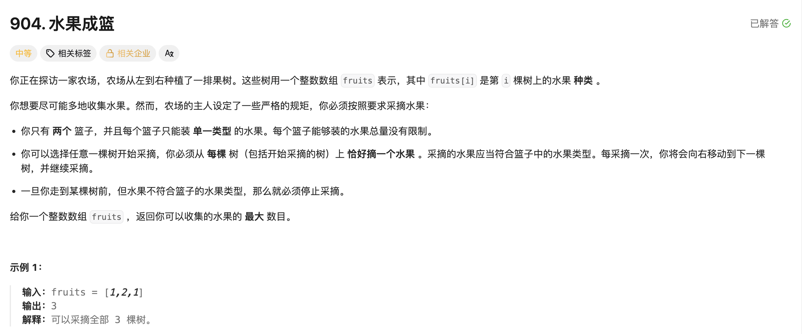

## 水果成篮

[题目链接](https://leetcode.cn/problems/fruit-into-baskets/)

### 1. 题目描述




### 2. 解题思路

> 1. 每次进窗口让哈希表中key值（水果种类）对应的val值（几棵树）加1；
> 2. 当哈希表的size > 2，说明大于两种水果了，就要出窗口：
>    - 每次--baskets[fruits[left]]，直到有一个减到0，就直接在哈希表中删除这个种类的水果。
> 3. 最后更新结果。


### 3. 实现代码 

````cpp
class Solution 
{
public:
    int totalFruit(vector<int>& fruits) 
    {
        unordered_map<int, int> baskets;
        int left = 0, right = 0, ans = 0;
        for (right = 0; right < fruits.size(); ++right)
        {
            // 进窗口
            ++baskets[fruits[right]];
            // 出窗口
            while (baskets.size() > 2)
            {   
                --baskets[fruits[left]];
                if (!baskets[fruits[left]]) baskets.erase(fruits[left]);
                ++left;
            }
            ans = max(right - left + 1, ans);
        }
        return ans;
    }
};
````
