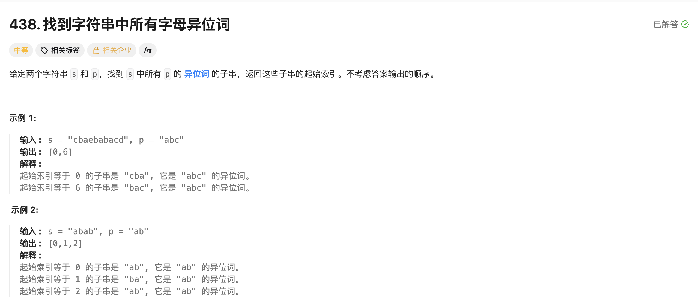

## 找到字符串中所有字母的异位词

[题目链接](https://leetcode.cn/problems/find-all-anagrams-in-a-string/description/)

### 1. 题目描述




### 2. 解题思路

> 此题是定长的窗口，定义两个哈希表 `int hash[26] = { 0 }`，p字符串中的每个字符进入`hash1`；
>
> 1. 每次进窗口让s中的每个字符进入`hash2`；
> 2. 当窗口大小等于`p.size()`时，让两个哈希表中的所有元素进行比较，如果全都相等，就插入left的下标；
>    - 因此这个比较的逻辑大概是`O(26n)`; 见实现代码1


#### 两哈希表比较的优化

> 1. 定义一个变量 count 用来记录当前窗口中有效字符的数量
>    - 有效字符是字符串p中的字符。
>
> 2. 每次字符串s的字符进窗口**之后**， 判断此字符在hash2中的个数是否小于等于在hash1中的个数，如果是，则说明进入窗口的是有效字符，让count加1；
> 3. 每次出窗口**之前**判断要出的这个字符在hash2中的个数是否小于等于在hash1中的个数，如果是，则说明出窗口的这个字符也是有效字符，让count减1；
> 4. 最后只需判断count是否等于p.size()即可。


### 3. 实现代码 

#### 版本1:

```cpp
class Solution 
{
public:
    vector<int> findAnagrams(string s, string p) 
    {
        int hash1[26] = { 0 };
        for (auto e : p)
        {
            hash1[e - 'a']++;
        }

        int hash2[26] = { 0 };
        int left = 0, right = 0;
        vector<int> ans;

        for (right = 0; right < s.size(); ++right)
        {
            char in = s[right];
            hash2[in - 'a']++;
            if (right - left + 1 == p.size())
            {
                char out = s[left];
              	// 两哈希表比较
                bool flag = true;
                for (int i = 0; i < 26; ++i)
                {
                    if (hash1[i] == hash2[i]) continue;
                    else
                    {
                        flag = false;
                        break;
                    }
                }
              	// 更新结果
                if (flag) ans.push_back(left);
              	// 出窗口逻辑
                hash2[out - 'a']--;
                ++left;
            }
        }
        return ans;
    }
};
```


#### 版本2

```cpp
class Solution 
{
public:
    vector<int> findAnagrams(string s, string p) 
    {
        int hash1[26] = { 0 };
        for (auto e : p)
        {
            hash1[e - 'a']++;
        }

        int hash2[26] = { 0 };
        int left = 0, right = 0;
        int count = 0;
        vector<int> ans;

        for (right = 0; right < s.size(); ++right)
        {
            // 1. 进窗口
            char in = s[right];
            hash2[in - 'a']++;
          	// 进窗口之后判断
            if (hash2[in - 'a'] <= hash1[in - 'a']) ++count;

            // 2. 判断条件出窗口
            if (right - left + 1 > p.size())
            {
              	// 出窗口之前判断
                char out = s[left];
                if (hash2[out - 'a'] <= hash1[out - 'a']) --count;
                hash2[out - 'a']--;
                ++left;
            }
            if (count == p.size()) ans.push_back(left);
        }
        return ans;
    }
};
```

