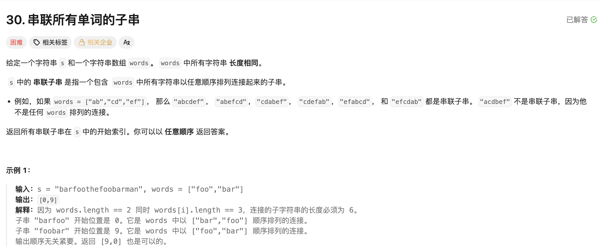

## 串联所有单词的子串 hard

[题目链接](https://leetcode.cn/problems/substring-with-concatenation-of-all-words/description/)

### 题目描述




### 解题思路

> 首先，可以将此题转化：
>
> - 既然words中的每个字符串长度相等，把它当作len，就可以把字符串每len个为一组；
> - 进而就可以把这题转化成找到字符串s中words的异位词。
>
> 运用滑动窗口来解答：
>
> 1. 每次截取right后的三个字符串进窗口，放到哈希表中；
> 2. 当 `window.size() + len > words.size() * len` 时，说明当前在哈希表中的字符串已经超过了words中的所有字符串长度之和，就要进行比较，是否是异位字符串；
>    - 仍然使用count来表示窗口中有效字符串的数量：
>      - 字符串进窗口之后，如果hash2[in] < hash1[in]，说明是有效字符，count++；
>      - 字符串出窗口之前，如果hash2[out] < hash1[out]，说明这个字符串也是有效字符串，count--
>    - 当有效字符串的长度等于words.size()，说明窗口中的字符串就是words的异位字符串，返回left。
> 3. 如果是在中间的某个位置开始才有异位字符串，这个位置之前的字符串长度并不是len的整数倍，就不会AC，因此要从头开始，小于len次开始判断。


### 实现代码

````cpp
class Solution 
{
public:
    vector<int> findSubstring(string s, vector<string>& words) 
    {
        unordered_map<string, int> hash1;
        unordered_map<string, int> hash2;
        int len = words[0].size();
        vector<int> ans;
        for (auto& word : words)
        {
            hash1[word]++;
        }
        
      	// 满足中间才会有异位字符串的情况
        for (int times = 0; times < len; ++times)
        {
          	int left = times, right = times, count = 0;
            for (left = times, right = times; right < s.size(); right += len)
            {
                // 1. 进窗口，取len个字符
                string in = s.substr(right, len);
                hash2[in]++;
                // 进窗口之后判断count
                if (hash2[in] <= hash1[in]) ++count;

                // 2. 判断条件，出窗口
                if (right - left + len > words.size() * len)
                {
                    string out = s.substr(left, len);
                    // 出窗口之前判断
                    if (hash2[out] <= hash1[out]) --count;
                    // 出窗口
                    hash2[out]--;
                    if (hash2[out] == 0) hash2.erase(out);
                    left += len;
                }
                if (count == words.size()) ans.push_back(left);
            }
            hash2.clear();
        }   
        
        return ans;
    }
};
````

