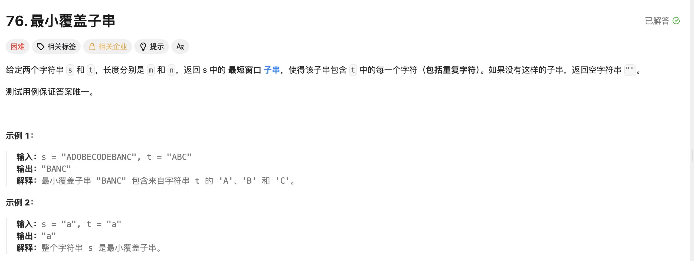

## 最小覆盖子串

[题目链接](https://leetcode.cn/problems/minimum-window-substring/description/)

### 题目描述




### 解题思路

> 当窗口中含有t字符串中所有字符的种类的时候就满足了要求。
>
> 因此应该记录窗口中字符的种类，与之前记录的窗口中字符的有效个数不一样。
>
> 1. 每次让right对应的val进窗口：
>    - 当hash1[in] == hash2[in]，说明这个字符在t中的数量和在窗口中的数量已经相等了，也就是说这个字符串的种类已经相等了，让kind++；
> 2. 当窗口中的种类和t的种类相等时，就要出窗口：
>    - 当某个字符出窗口之前满足 hash1[out] == hash2[out]，说明这个种类在此次出窗口之后就不满足在t中的数量了，也就是说窗口中的这个字符的数量和t中这个字符的数量不相等，就可以把这个kind--；
> 3. 进入窗口时，满足最短窗口的条件，可以更新最短窗口的值。


### 实现代码

````cpp
class Solution 
{
public:
    string minWindow(string s, string t) 
    {
        int hash1[128] = { 0 };
        int hash2[128] = { 0 };
        int type = 0;
        for (auto ch : t) 
        {
            if (hash1[ch] == 0)
            {
              	// 记录在t中的字符种类
                ++type;
            }
            hash1[ch]++;
        }
      	// kind 记录种类
        int left = 0, right = 0, kind = 0;
        int minlen = INT_MAX, begin = -1;
        for (right = 0; right < s.size(); ++right)
        {
            // 1. 进入窗口
            char in = s[right];
            hash2[in]++;
            // 其中一个字符串相同，种类 + 1 
            if (hash2[in] == hash1[in]) ++kind;

            while (kind == type)
            {
                int len = right - left + 1;
                // 更新子串
                if (len < minlen)
                {
                    minlen = len;
                    begin = left;
                }
                // 出窗口
                char out = s[left];
                // 出窗口之前判断种类
                if (hash1[out] == hash2[out])
                {
                    --kind;
                }
                hash2[out]--;
                ++left;
            }
        }
        if (begin == -1) return "";
        return s.substr(begin, minlen);
    }
};
````

